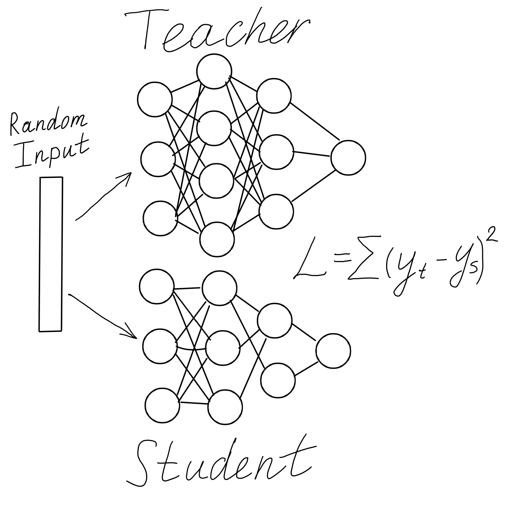

# Retrainer

Retrainer is a specialized tool designed to train neural network models with another architecture to reproduce the same result as input model.



It generates random input data and train Student model to reproduce the same result as Teacher model.

## Installation

Firstly, you need to install all dependencies required for this project. You can do it easily just run:

```bash
make install
```

This command creates file `Manifest.toml`. It means that you are ready to run this code.
  
## Usage

There are two ways to run this code:

1. From `Jupyter Notebook` (recommended). For this, you need to run all cells from `run_me.ipynb` file. It will do everything for `example-methanol-model.bson` file automatically.
2. From the terminal. If you want to run this program as a command-line application:
   - Configure `input.toml`
   - `julia main.jl` – to see help
   - or `make run` to run the example

## Authors and License

- Maksim Posysoev (<maxim.posysoev@gmail.com>)
- Prof. Alexander Lyubartsev (<alexander.lyubartsev@mmk.su.se>)

*GNU GPL-3.0 license*
