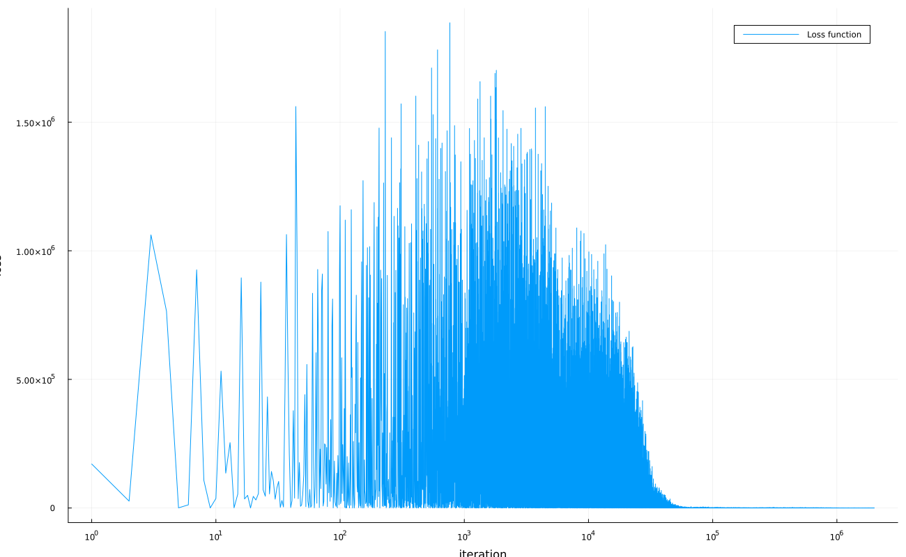

# NN_Retrainer

NN_Retrainer is a specialized tool designed to train neural network models with another architecture to reproduce the same result as input model.

 
Loss function plot
  
## Usage

Just run all cells in file run_me.ipynb

## License

NN_Retrainer is released under the GNU GPL 3 License. See the LICENSE file for more details.
